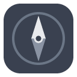

<div align="center">
  
  <h1>Compass</h1>
  <p><strong>A purposeful new tab page.</strong> Replace the empty new tab with a daily intention, your goals, a rotating Stoic quote, a reading hub, gentle time-tracking, and optional two-way Obsidian sync.</p>
  <p>
    
    
    
    
  </p>
</div>

> Everything stays on your machine. No accounts, no servers, no analytics. See [Privacy](#privacy--data).

<!--
  Screenshots: add real captures to docs/screenshots/ and embed them here, e.g.
  
  
  With the extension loaded, a new tab + Cmd/Ctrl+Shift+4 is all it takes.
-->

## Why

Every new tab is a small fork in the road: pick up a task, or drift. Compass
turns that moment into a nudge toward what you actually meant to do — and, if you
want, quietly measures where your time really goes so you can course-correct.

## Features

- **Daily intention & goals** — set one intention for the day; check off goals as
  you go. Separate long-term goals for the bigger stuff.
- **Rotating Stoic quote** — a line from Marcus Aurelius's *Meditations* each day
  (fully editable — it's just a list).
- **Reading hub** — a right-click or toolbar click saves any page to read later.
- **Reminders & quick links** — your own short nudges and one-click destinations.
- **Time tracking** — see where the day went, grouped into categories you define.
  Idle/locked time is excluded automatically.
- **Escalating site limits** — set a daily budget for a distracting site; an
  overlay grows more insistent the more you overrun it.
- **Dashboard** — bar charts, a heatmap, and stat cards over your tracked time,
  plus all-time browsing insights.
- **Obsidian sync (optional)** — two-way sync of goals/reading with your vault
  via the Local REST API plugin. Off by default.
- **Themes** — auto / light / dark, with a configurable accent colour.

## Install

### From a release (no build needed)

1. Download `compass-vX.Y.Z.zip` from the [Releases](../../releases) page and unzip it.
2. Open `chrome://extensions` (works in Chrome, Edge, Brave, and other Chromium browsers).
3. Turn on **Developer mode** (top-right).
4. Click **Load unpacked** and select the unzipped folder.
5. Open a new tab. 🧭

### From source

```bash
pnpm install
pnpm build        # outputs to dist/
```

Then **Load unpacked** → select the `dist/` folder.

## Privacy & data

Compass is local-first by design:

- All your data lives in **your browser only** — `chrome.storage.local` and
  IndexedDB. Nothing is uploaded anywhere.
- **No servers, no analytics, no telemetry, no third-party requests.**
- The **only** network request the extension ever makes is to the Obsidian vault
  sync address *you* configure (defaults to `http://127.0.0.1:27123`, your own
  machine), and only when you turn sync on. That code is isolated in
  [`src/lib/vault.ts`](src/lib/vault.ts) — it is the single `fetch` call site in
  the codebase.

Because it's open source, you can verify all of the above yourself.

## Permissions — and why each is needed

Chrome asks for these up front. Here's the honest reason for each:

| Permission | Why Compass needs it |
| --- | --- |
| `storage` | Save your settings, goals, reading list, and reminders locally. |
| `contextMenus` | The right-click "save this page to read later" entry. |
| `tabs` | Read the current tab's URL/title for the save popup and time tracking. |
| `idle` | Pause time tracking when your machine is idle or locked. |
| `alarms` | Periodically flush the in-progress time segment so nothing is lost. |
| `scripting` | Inject the escalating-limit overlay into a page you've set a limit on. |
| `history` | Power the all-time browsing insights on the dashboard. |
| `host_permissions: <all_urls>` | Time tracking works on any site, the limit overlay can appear on any limited site, and vault sync can reach your local Obsidian API. Compass reads only URLs/titles for tracking — it does not read page contents. |

Prefer a smaller footprint? The permissions live in
[`manifest.config.ts`](manifest.config.ts) — remove `history` (drops all-time
insights) or narrow `host_permissions` and rebuild.

## Obsidian sync (optional)

1. In Obsidian, install the **Local REST API** community plugin and copy its API key.
2. In Compass → **Settings → Vault**, enable sync and paste the key. Leave the
   base URL as `http://127.0.0.1:27123` unless you changed it.

The key is stored locally and only sent to that address.

## Customize

Compass is meant to be forked and made yours. The knobs:

| What | Where |
| --- | --- |
| Default settings, quick links, category rules, accent colour | `DEFAULT_SETTINGS` in [`src/lib/storage.ts`](src/lib/storage.ts) |
| Default reminders | `DEFAULT_REMINDERS` in [`src/lib/storage.ts`](src/lib/storage.ts) |
| Daily quotes | [`src/lib/quotes.ts`](src/lib/quotes.ts) |
| Icon | [`public/icons/icon.svg`](public/icons/icon.svg) → run `node scripts/gen-icons.mjs` |

## Development

```bash
pnpm dev          # Vite dev server with HMR (load the built dev extension)
pnpm typecheck    # tsc -b --noEmit
pnpm test         # vitest
pnpm build        # production build to dist/
```

Built with Vite 8, [@crxjs/vite-plugin](https://crxjs.dev/), React 19,
TypeScript, and [`idb`](https://github.com/jakearchibald/idb).

## Contributing

Issues and PRs are welcome — see [CONTRIBUTING.md](CONTRIBUTING.md).

## License

[MIT](LICENSE) © Sujal Shrestha
