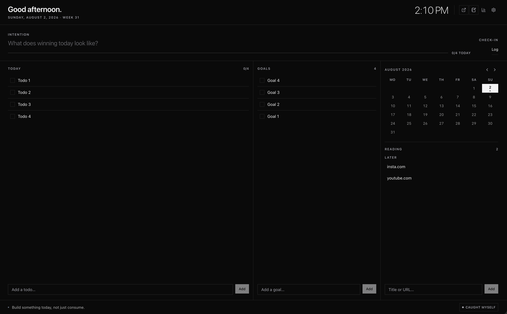
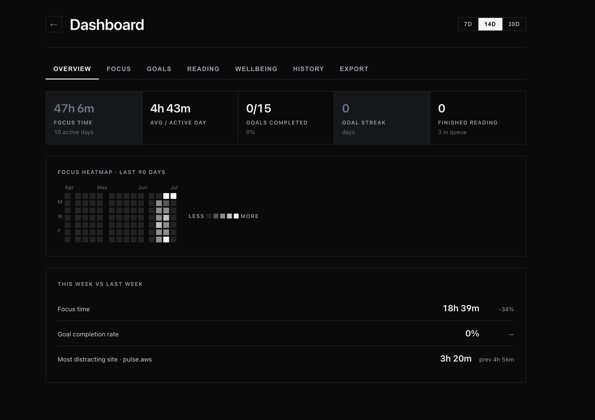

<div align="center">
  
  <h1>Compass</h1>
  <p><strong>A purposeful new tab page.</strong> Replace the empty new tab with your day at a glance: tasks, calendar, long-term goals, the books you're reading, habits, a focus timer, and a daily Stoic quote — with optional two-way Obsidian sync.</p>
  <p>
    
    
    
    
  </p>
</div>

> Everything stays on your machine. No accounts, no servers, no analytics. See [Privacy](#privacy--data).

<p align="center">
  
</p>
<p align="center"><em>New tab: daily quote, intention, mood check-in, and long-term goals.</em></p>

<p align="center">
  
</p>
<p align="center"><em>Dashboard: focus time, heatmap, and week-over-week comparison.</em></p>

## Why

Every new tab is a small fork in the road: pick up a task, or drift. Compass
turns that moment into a nudge toward what you actually meant to do — and, if you
want, quietly measures where your time really goes so you can course-correct.

## Features

- **Today at a glance** — a greeting and one line that sums up your day: tasks
  left and what's next on your calendar.
- **Tasks** — mark the important ones, link them to a long-term goal, click to
  edit, delete with Undo. Unfinished tasks from earlier in the week are offered
  to carry over. Finishing the last one gets a small celebration.
- **Calendar** — connect Google, Outlook or iCloud calendars through their
  private iCal link. Today's agenda shows what's live and what's next; the month
  view marks days with events and tasks. Refreshed every 15 minutes in the
  background, so a new tab never waits on the network.
- **Long-term goals** — each one can have milestones (which drive its progress
  bar), a target date, and a one-line "why". Tasks you link to a goal count
  toward it.
- **Reading** — books with page tracking and generated covers, a yearly reading
  goal, star ratings for finished books, and saved articles (right-click any
  page, or use the toolbar popup).
- **Habits** — a 7-day strip per habit and streaks, with a nudge at milestones.
- **Focus timer** — Pomodoro-style sessions that keep running with every tab
  closed; you get a notification when one ends, and the minutes are logged.
- **Intention, check-in, reflection** — one line for what would make today a
  win, a one-tap mood and energy check-in, and an evening reflection prompt.
- **⌘K / Ctrl+K** — add a task, goal, book or note from anywhere, or search
  and jump. `n` focuses the task field.
- **Quick capture** — the toolbar popup saves the page or adds a task for today;
  right-click selected text → "Add as a task for today".
- **Rotating Stoic quote & reminders** — a line from Marcus Aurelius's
  *Meditations* each day, with your own reminders underneath.
- **Time tracking** — see where the day went, grouped into categories you define.
  Idle/locked time is excluded automatically.
- **Escalating site limits** — set a daily budget for a distracting site; an
  overlay grows more insistent the more you overrun it.
- **Dashboard** — bar charts, a heatmap, and stat cards over your tracked time,
  plus all-time browsing insights.
- **Obsidian sync (optional)** — two-way sync of goals/reading with your vault
  via the Local REST API plugin. Off by default.
- **Your data, protected** — Compass takes a snapshot of your data every day
  and keeps the last 14, and you can export everything to a JSON file (and
  import it back) from **Settings → Data**.
- **Themes** — auto / light / dark in a warm, easy-to-read palette, with an
  accent colour you choose. Motion respects "reduce motion".

## Install

### From a release (no build needed)

1. Download `compass-vX.Y.Z.zip` from the [Releases](../../releases) page and unzip it.
2. Open `chrome://extensions` (works in Chrome, Edge, Brave, and other Chromium browsers).
3. Turn on **Developer mode** (top-right).
4. Click **Load unpacked** and select the unzipped folder.
5. Open a new tab. 🧭

### From source

```bash
pnpm install
pnpm build        # outputs to dist/
```

Then **Load unpacked** → select the `dist/` folder.

## Privacy & data

Compass is local-first by design:

- All your data lives in **your browser only** — `chrome.storage.local` and
  IndexedDB. Nothing is uploaded anywhere.
- **No servers, no analytics, no telemetry.** No third-party requests beyond the calendar links you add yourself.
- The extension only makes network requests to addresses *you* configure:
  - the Obsidian vault sync address (defaults to `http://127.0.0.1:27123`, your
    own machine), only when you turn sync on —
    [`src/lib/vault.ts`](src/lib/vault.ts);
  - the calendar iCal links you add in **Settings → Calendar**, fetched
    directly from your calendar provider —
    [`src/lib/calendar.ts`](src/lib/calendar.ts).

  Those two files are the only `fetch` call sites in the codebase.

Because it's open source, you can verify all of the above yourself.

## Permissions — and why each is needed

Chrome asks for these up front. Here's the honest reason for each:

| Permission | Why Compass needs it |
| --- | --- |
| `storage` | Save your settings, goals, reading list, and reminders locally. |
| `contextMenus` | The right-click "save this page to read later" entry. |
| `tabs` | Read the current tab's URL/title for the save popup and time tracking. |
| `idle` | Pause time tracking when your machine is idle or locked. |
| `alarms` | Periodically flush the in-progress time segment so nothing is lost. |
| `scripting` | Inject the escalating-limit overlay into a page you've set a limit on. |
| `history` | Power the all-time browsing insights on the dashboard. |
| `notifications` | Tell you when a focus session or break ends. |
| `unlimitedStorage` | Keep years of days, tasks and reading history without hitting Chrome's 10 MB storage cap. |
| `favicon` | Show site icons for quick links and saved articles, from Chrome's own local icon cache (no network request). |
| `host_permissions: <all_urls>` | Time tracking works on any site, the limit overlay can appear on any limited site, vault sync can reach your local Obsidian API, and your calendar feeds can be fetched. Compass reads only URLs/titles for tracking — it does not read page contents. |

Prefer a smaller footprint? The permissions live in
[`manifest.config.ts`](manifest.config.ts) — remove `history` (drops all-time
insights) or narrow `host_permissions` and rebuild.

## Obsidian sync (optional)

1. In Obsidian, install the **Local REST API** community plugin and copy its API key.
2. In Compass → **Settings → Vault**, enable sync and paste the key. Leave the
   base URL as `http://127.0.0.1:27123` unless you changed it.

The key is stored locally and only sent to that address.

## Customize

Compass is meant to be forked and made yours. The knobs:

| What | Where |
| --- | --- |
| Default settings, quick links, category rules, accent colour | `DEFAULT_SETTINGS` in [`src/lib/storage.ts`](src/lib/storage.ts) |
| Default reminders | `DEFAULT_REMINDERS` in [`src/lib/storage.ts`](src/lib/storage.ts) |
| Daily quotes | [`src/lib/quotes.ts`](src/lib/quotes.ts) |
| Icon | [`public/icons/icon.svg`](public/icons/icon.svg) → run `node scripts/gen-icons.mjs` |

## Development

```bash
pnpm dev          # Vite dev server with HMR (load the built dev extension)
pnpm typecheck    # tsc -b --noEmit
pnpm test         # vitest
pnpm build        # production build to dist/
```

Built with Vite 8, [@crxjs/vite-plugin](https://crxjs.dev/), React 19,
TypeScript, and [`idb`](https://github.com/jakearchibald/idb).

## Contributing

Issues and PRs are welcome — see [CONTRIBUTING.md](CONTRIBUTING.md).

## License

[MIT](LICENSE) © Sujal Shrestha
